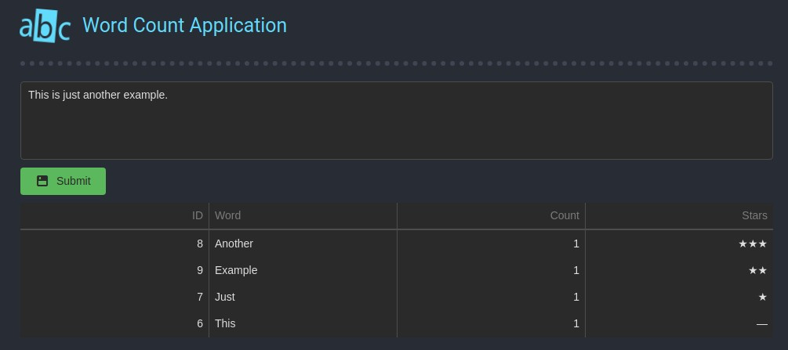

# word-count-app

Containerized demo application using Symfony 5 for backend, React for frontend and mariadb on database layer.



# Running application
Run ```docker-compose up```. Frontend should be exposed on 3005 port.